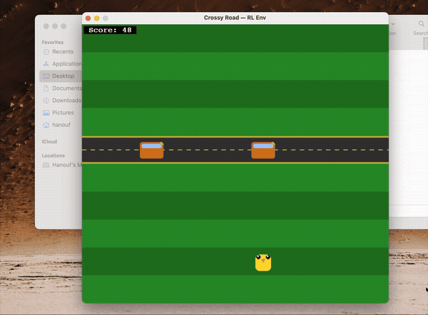

# Crossy Road — RL from Scratch

A fully playable Crossy Road clone built with Pygame and Gymnasium, trained with Proximal Policy Optimization (PPO) via Stable-Baselines3 — entirely on CPU, no GPU needed.

---

## What We Built

| File | Purpose |
|------|---------|
| `crossy_env.py` | Gymnasium environment — game logic, world generation, Pygame rendering |
| `train.py` | PPO training script (CPU-optimised) |
| `play.py` | Human play mode — real-time, keyboard controlled |
| `watch.py` | Watch the trained agent play |

### Game Mechanics
- **Grid**: 11 × 10 cells, `TILE_SIZE = 64px`
- **Actions**: UP / DOWN / LEFT / RIGHT / STAY (5 discrete actions)
- **Row types**: Grass (always safe) · Road (cars — deadly on contact) · Water (logs — deadly if no log under player)
- **Observation**: flat `float32` array of shape `(224,)` — current grid (terrain + cars/logs encoded by direction), 1-step-ahead danger/log grid, and 4 scalar features (player row, scroll progress, difficulty, is\_riding\_log)
- **Reward**: `+1` for each new furthest row reached (high-water mark) · `+0.05` per tick on grass · `+0.02` per tick on log · `-0.005` per tick on road · `-1` on death
- **Difficulty**: ramps over 200 forward hops — road/water density, car count, car speed, and auto-scroll rate all increase

---

## How to Run

```bash
pip install gymnasium stable-baselines3 pygame numpy

python play.py                         # play yourself
python train.py                        # train the agent (~150 min on CPU)
python watch.py                        # watch the best trained agent
python watch.py models/ppo_crossy_final  # watch a specific checkpoint
```

Optional flags:
```bash
python train.py --timesteps 10000000          # faster ~75-min run
python train.py --n-envs 8                    # fewer parallel envs (less RAM)
python train.py --continue-from models/best_model  # resume from checkpoint
```

---

## Architecture

### Environment
The env follows the standard Gymnasium API (`reset` / `step` / `render`).  
World generation is **section-based**: rows are produced in chunks of 1–3 (all grass or all road, same direction), creating realistic multi-lane traffic sections rather than random isolated rows.

The **auto-scroll death zone** marches the world forward every N ticks regardless of player input. If the bird falls behind it gets pushed off the bottom edge and dies — this is the core mechanic that forces continuous forward progress.

### Observation (224 floats)

**Current-state grid (110 floats)**
| Value | Meaning |
|-------|---------|
| `0.00` | Grass (safe) |
| `0.10` | Water — deadly if standing here |
| `0.22` | Log moving right (safe platform) |
| `0.32` | Log moving left (safe platform) |
| `0.45` | Empty road |
| `0.55` | Car moving right, fast |
| `0.63` | Car moving right, slow |
| `0.73` | Car moving left, fast |
| `0.82` | Car moving left, slow |
| `1.00` | Player |

**1-step-ahead danger/log grid (110 floats)**  
Shows where things will be on the *next* simulation tick: `1.0` = car or exposed water (dangerous), `0.5` = log (safe), `0.0` = safe. Lets the agent plan crossings and log jumps without having to infer movement from static snapshots.

**Scalar features (4 floats)**
| Scalar | Meaning |
|--------|---------|
| `player_row / 9` | How close to the bottom edge |
| `scroll_tick / interval` | How close to next auto-scroll |
| `difficulty` | Current difficulty (0 → 1) |
| `is_riding_log` | 1 if currently on a log, 0 otherwise |

### RL Setup
- **Algorithm**: PPO with MLP policy
- **Network**: `[256, 256]` hidden layers
- **Parallel envs**: 16 (via `make_vec_env`)
- **Rollout buffer**: 2048 steps × 16 envs = 32 768 transitions per update
- **Learning rate**: linear decay `3e-4 → 3e-5`
- **Entropy coefficient**: `0.01`

---

## Challenges We Faced

### 1. Cars Didn't Move Without Player Input
**Problem**: The original step-based design only advanced cars when the player pressed a key. Standing still meant the world was frozen — it felt nothing like the real game.

**Fix**: Added a STAY action (action `4`) and rewrote `play.py` to use `pygame.time.set_timer()` firing every 120ms. Each timer tick calls `env.step()` whether or not a key was pressed. Cars now advance in real time.

---

### 2. Going Straight Never Killed You
**Problem**: The world generator used `exclude_col` — it never spawned a car at the player's column when generating a new row. The player could rush straight forward indefinitely without dying.

**Fix**: Removed `exclude_col`. Added section-based world generation so roads come in multi-lane groups, forcing the player to actually time their crossings.

---

### 3. No Difficulty Curve
**Problem**: The game was equally hard (or easy) from score 0 to infinity.

**Fix**: All generation parameters scale with `_difficulty()` (0 → 1 over 200 hops):
- **Road probability**: 25% → 83%
- **Cars per lane**: 2 → 5
- **Fast cars (speed-1)**: 6% → 83%
- **Auto-scroll interval**: 28 ticks → 8 ticks

---

### 4. Screen Didn't Follow the Bird
**Problem**: The world only scrolled when the bird literally went off the top edge (row `-1`). It looked jarring and nothing like the original game's camera follow.

**Fix**: Added `SCROLL_THRESHOLD = 3`. When the bird would move above row 3, the world scrolls instead — keeping the bird in the lower third of the screen at all times.

---

### 5. The Agent Learned to Cheat (Reward Hacking)
**Problem**: This was the most interesting bug. After the first training run the agent reached a **mean reward of 932** — which sounded impressive until we watched it play. It had discovered that going forward then backward then forward again gave double points, because reward was `score += 1` on every UP press regardless of whether it was new territory.

The agent essentially learned: *take one step forward, one step back, repeat forever*.



**Fix**: Replaced cumulative scoring with a **high-water mark**. The agent only earns `+1` when it reaches a position further than it has ever been. Re-advancing old ground gives `0` bonus. This is also how the original game scores.

---

### 6. No Consequence for Going Backward
**Problem**: Even with the reward fix, going backward had only a tiny step penalty. The agent had no real urgency to move forward.

**Fix**: Added an **auto-scroll death zone** mimicking the original game's scrolling camera. Every N ticks the world marches forward automatically. The player's visual row increases; if it reaches the bottom edge they die. The scroll interval shrinks with difficulty (28 ticks → 8 ticks), creating increasing urgency.

---

### 7. Agent Plateaued at ~40 Score (Blind to Car Speed and Scroll Timing)
**Problem**: After fixing the rules, the agent hit a ceiling around mean reward 40–43 and stopped improving across two full training runs. Watching it play revealed why — it was treating fast and slow cars identically, and had no idea when the next auto-scroll was coming.

Three root causes:
- **Car speed was invisible** — both speed-1 (fast) and speed-2 (slow) cars were encoded the same way (`0.66`), so the agent couldn't time crossings differently for each.
- **Scroll urgency was invisible** — the agent didn't know how close it was to the bottom edge or how many ticks until the world scrolled again.
- **Difficulty ramp too steep** — max difficulty was reached at score 80, so the agent rarely got to practice harder stages and couldn't learn from them.

**Fix**:
- Expanded car encoding to 4 values (direction × speed), so the agent can distinguish slow vs fast traffic.
- Added `player_row`, `scroll_progress`, and `difficulty` as explicit scalar features in the observation.
- Slowed difficulty ramp from score 80 to score 200 — gives the agent far more experience in the learnable middle range before things get brutal.
- Added a small grass survival bonus (`+0.05/tick`) to reward waiting on safe rows instead of rushing blindly into traffic.
- Increased training from 5M to 10M steps, and network from `[64, 64]` to `[128, 128]`.

---

### 8. Agent Plateaued at ~80 Score (Flying Blind Into Traffic)
**Problem**: At mean reward ~79.7 the agent stalled again. Watching it play, it would hesitate at road edges and sometimes step into a gap that was already closing — it could see where cars *were* but couldn't anticipate where they'd *be* when it arrived.

Four root causes:
- **No temporal lookahead** — the obs only showed current car positions. The agent had to implicitly infer car trajectories from direction/speed encodings, which requires a lot of network capacity to approximate.
- **Network too small** — `[128, 128]` lacked the capacity to learn both car-timing and scroll-urgency reasoning simultaneously.
- **Rollouts too short** — `n_steps=512` × 8 envs = only 4k transitions per policy update; gradient estimates were noisy.
- **Grass bonus was mis-incentivised** — `+0.05/step` on grass meant waiting 20 steps equalled crossing one row, so the agent sometimes chose to idle rather than cross a manageable road.

**Fix**:
- Added a **1-step-ahead danger grid** to the observation: for each of the 110 cells, a binary flag showing where every car will be on the next tick. The agent can now directly see which squares are about to become dangerous.
- Added a small **road step penalty** (`-0.005/tick`) so the agent is nudged to cross roads promptly rather than stall.
- Expanded network to `[256, 256]` (4× more parameters).
- Increased rollout buffer: `n_steps=2048` × 16 envs = 32 768 transitions per update.
- Added linear learning rate decay `3e-4 → 3e-5` so training refines strategy rather than thrashing late in training.
- Scaled to 20M total steps.

---

### 9. Adding Water + Log Rows (Requires Full Retrain)
Water rows introduce a mechanic that is the *opposite* of roads: instead of avoiding moving objects, the player must **land on** them (logs) and ride them across. Standing on open water is instant death.

**Why a full retrain is needed:**
- **Observation space changes** — new cell encodings for water and logs, plus an `is_riding_log` scalar, change the obs shape from `(223,)` to `(224,)`. PyTorch refuses to load a checkpoint with a different input size.
- **Inverted strategy** — the existing model has 20M steps of "moving object = death" baked in. It would actively avoid logs, which is exactly the wrong behavior. Fine-tuning from that starting point would fight the old policy the whole way.
- **New death condition** — stepping onto a water cell with no log is a failure mode the agent has never seen; the reward signal needs to be learned from scratch.

**What was implemented:**
- `WATER` row type with multi-cell floating logs (2–3 cells wide, always slow)
- Player is carried laterally by the log they stand on each tick; log moving off screen → death
- Water sections appear from score 0 (20% of sections) and ramp to 30% at max difficulty — visible in the first few rows of every game
- Lookahead grid extended: `0.5` = log next step, `1.0` = car or exposed water next step
- Blue water rendering with log planks; `is_riding_log` scalar added to obs
- `--continue-from` with the old Run 5 checkpoint will crash — obs shape changed from `(223,)` to `(224,)`; always train fresh for this env

---

## Results

| Run | Mean Reward | Peak Episode | Notes |
|-----|-------------|--------------|-------|
| Run 1 (2M steps) | **932** | — | Agent was cheating — forward/back exploit |
| Run 2 (2M steps) | **31.7** | — | Honest score after rule fixes |
| Run 3 (5M steps) | **~40** | 43.2 | Plateaued — obs too limited |
| Run 4 (10M steps) | **79.7** | — | Fixed obs + slower difficulty ramp |
| Run 5 (20M steps) | **225** | **472** | Lookahead obs + larger net + tuned hyperparams |
| Run 6 (80M steps) | **61.7** | — | Water + log rows added; full retrain from scratch |

Run 6 introduced water + log rows — a fundamentally harder environment where the agent must learn two opposite strategies simultaneously (avoid cars on roads, seek logs on water). Mean reward dropped from 225 to 61.7, which is expected: the task is significantly more complex and the agent is starting from scratch with no prior knowledge of log riding.

Indicators that training hasn't converged yet: `explained_variance=0.585` (vs 0.887 in Run 5) means the value function is still struggling to model the mixed road/water environment accurately. More steps will help.

Total training time: **~2.5 hours** (Run 5, roads only) · **~8.5 hours** (Run 6, water + logs, 80M steps).

---

## What's Next

- CNN policy with pixel observations
- Curriculum learning — fix difficulty at an easy level until agent masters it, then ramp
- Population-based training to auto-tune hyperparameters
